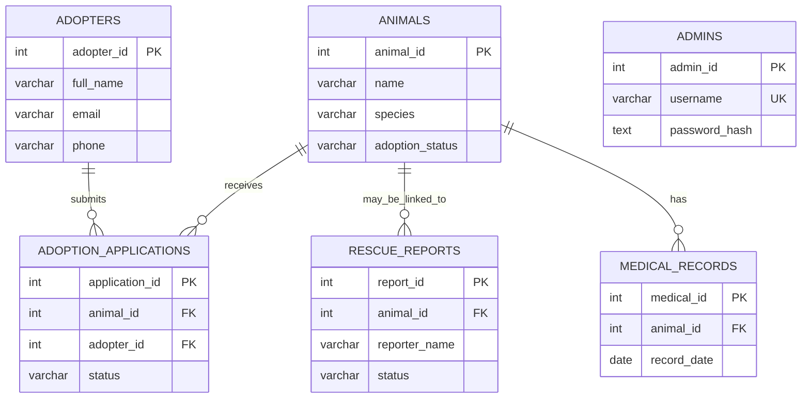

# Database schema overview

```mermaid
erDiagram
    ANIMALS ||--o{ ADOPTION_APPLICATIONS : receives
    ADOPTERS ||--o{ ADOPTION_APPLICATIONS : submits
    ANIMALS ||--o{ RESCUE_REPORTS : may_be_linked_to
    ANIMALS ||--o{ MEDICAL_RECORDS : has
    ADMINS {
      int admin_id PK
      varchar username UK
      text password_hash
    }
    ANIMALS {
      int animal_id PK
      varchar name
      varchar species
      varchar adoption_status
    }
    ADOPTERS {
      int adopter_id PK
      varchar full_name
      varchar email
      varchar phone
    }
    ADOPTION_APPLICATIONS {
      int application_id PK
      int animal_id FK
      int adopter_id FK
      varchar status
    }
    RESCUE_REPORTS {
      int report_id PK
      int animal_id FK
      varchar reporter_name
      varchar status
    }
    MEDICAL_RECORDS {
      int medical_id PK
      int animal_id FK
      date record_date
    }
```
